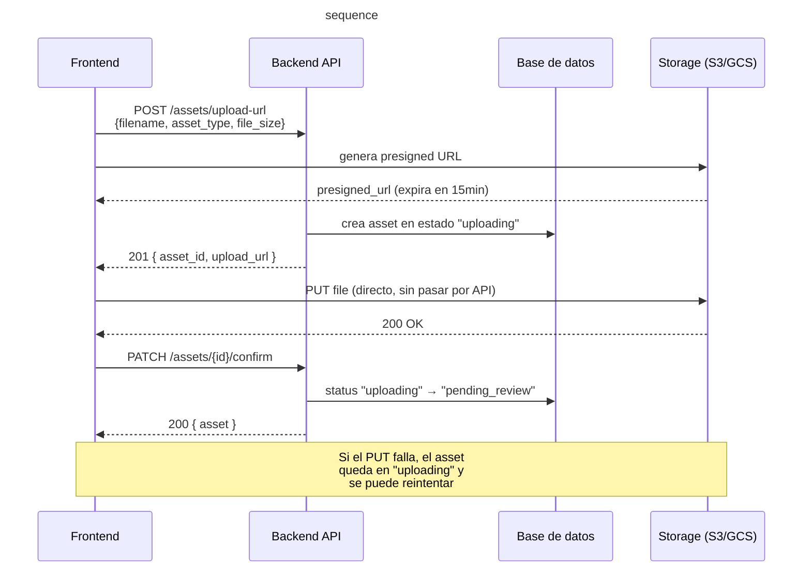

# Sistema de Gestión de Activos Creativos

API REST para gestionar el ciclo de vida de piezas creativas (imágenes, videos, PDFs) dentro de proyectos de agencias y freelancers. Permite subir activos, versionar archivos, registrar aprobaciones/rechazos y comentarios, manteniendo trazabilidad completa.

---

## Stack tecnológico

| Componente   | Tecnología                          |
|--------------|-------------------------------------|
| Lenguaje     | Python 3.11+                        |
| Framework    | FastAPI 0.115                       |
| Base de datos| SQLite (desarrollo) / PostgreSQL (producción) |
| ORM          | SQLAlchemy 2.0                      |
| Validación   | Pydantic v2                         |
| Servidor     | Uvicorn                             |

---

