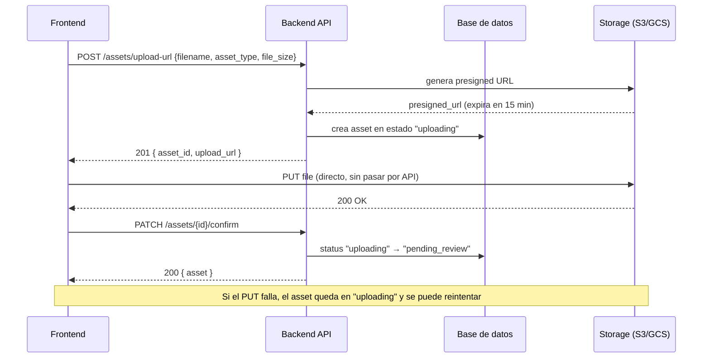

# Sistema de Gestión de Activos Creativos

API REST para gestionar el ciclo de vida de piezas creativas (imágenes, videos, PDFs) dentro de proyectos de agencias y freelancers. Permite subir activos, versionar archivos, registrar aprobaciones/rechazos y comentarios, manteniendo trazabilidad completa.

---

## Stack tecnológico

| Componente    | Tecnología                                        |
|---------------|---------------------------------------------------|
| Lenguaje      | Python 3.11+                                      |
| Framework     | FastAPI                                           |
| Base de datos | SQLite (desarrollo) / PostgreSQL (producción)     |
| ORM           | SQLAlchemy 2.0 async (`asyncpg`)                  |
| Validación    | Pydantic v2                                       |
| Servidor      | Uvicorn                                           |

---

## Correr localmente

```bash
pip install -r requirements.txt

# Configurar variable de entorno en .env
DATABASE_URL=sqlite+aiosqlite:///./dev.db

uvicorn main:app --reload
# Docs: http://localhost:8000/docs
```

Para PostgreSQL, ejecutar `sql/seed.sql` primero para crear las tablas y cargar datos de prueba.

---

## Estructura del proyecto

```
main.py                  # Entry point: app, exception handlers, routers
app/
  model/__init__.py      # Modelos SQLAlchemy (Agency, Project, User, Asset, AssetVersion, Approval, Comment)
  schemas.py             # Schemas Pydantic (request/response)
  routers/
    assets.py            # Endpoints de assets
  database/
    connection.py        # Engine y SessionLocal (async)
    deps.py              # Dependencia get_db para FastAPI
sql/
  seed.sql               # DDL + datos de prueba para PostgreSQL
```

---

## Endpoints implementados

| Método | Ruta           | Descripción                                             |
|--------|----------------|---------------------------------------------------------|
| GET    | `/health`      | Health check                                            |
| POST   | `/assets`      | Crea un asset + primera versión (`pending_review`)      |
| GET    | `/assets/{id}` | Retorna el asset con todas sus versiones y aprobaciones |

### POST /assets — body

```json
{
  "title": "Banner Principal",
  "description": "...",
  "asset_type": "image",
  "project_id": "uuid",
  "agency_id": "uuid",
  "created_by": "uuid",
  "file_url": "https://...",
  "file_name": "banner.jpg",
  "file_size_bytes": 2048000,
  "version_notes": "Primera versión"
}
```

`asset_type` acepta: `image`, `video`, `pdf`.

---

## Modelo de dominio

```
Agencia → Proyecto → Asset → AssetVersion (historial lineal e inmutable)
```

**Roles:** `admin`, `designer`, `reviewer`, `client`

### Estados de un asset

```
pending_review  ──[reviewer/client aprueba]──►  approved
pending_review  ◄──[designer sube versión]───   rejected
approved        ──[admin archiva]────────────►  archived
```

### Reglas clave

- El `version_number` empieza en 1 y se incrementa como `MAX + 1` por asset. Las versiones anteriores son **inmutables**.
- Solo la versión actual puede recibir una aprobación o rechazo.
- Solo usuarios con rol `client` o `reviewer` pueden registrar aprobaciones.
- Los comentarios se asocian a una `asset_version` específica y **no modifican** el estado del asset.
- Las aprobaciones nunca se modifican ni eliminan (trazabilidad completa).

---

## Flujo de subida de archivo



---

## Supuestos de implementación

1. **Sin autenticación** — el `user_id` se recibe en el cuerpo del request. En producción vendría del JWT/sesión.
2. **Almacenamiento simulado** — `file_url` se guarda como string. No hay integración real con S3/GCS.
3. **Un solo aprobador es suficiente** — la primera decisión registrada determina el estado del asset. El flujo multi-firma queda para una fase posterior.
4. **Sin notificaciones** — ningún evento (subida, aprobación, comentario) dispara emails ni notificaciones en sistema.
5. **Un proyecto pertenece a una sola agencia** — la relación `projects.agency_id` es única e inmutable.
6. **Versionado lineal** — no hay branches ni merges de versiones (1 → 2 → 3 → …).
