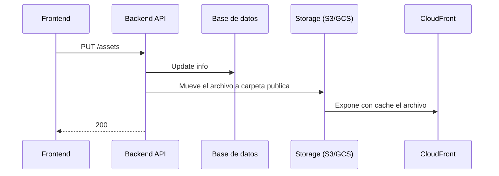

# Sistema de Gestión de Activos Creativos

API REST para gestionar el ciclo de vida de piezas creativas (imágenes, videos, PDFs) dentro de proyectos de agencias y freelancers. Permite subir activos, versionar archivos, registrar aprobaciones/rechazos y comentarios, manteniendo trazabilidad completa.

---

## Stack tecnológico

| Componente    | Tecnología                                        |
|---------------|---------------------------------------------------|
| Lenguaje      | Python 3.11+                                      |
| Framework     | FastAPI                                           |
| Base de datos | SQLite (desarrollo) / PostgreSQL (producción)     |
| ORM           | SQLAlchemy 2.0 async (`asyncpg`)                  |
| Validación    | Pydantic v2                                       |
| Servidor      | Uvicorn                                           |

---

## Correr localmente

### 1. Crear y activar entorno virtual

```bash
python -m venv venv && source venv/bin/activate
```

### 2. Instalar dependencias

```bash
pip install -r requirements.txt
```

### 3. Iniciar el servidor

```bash
fastapi dev
```

Para PostgreSQL, ejecutar `sql/seed.sql` para cargar datos de prueba.

La API queda disponible en `http://localhost:8000`.
Documentación interactiva: `http://localhost:8000/docs`

---

## Estructura del proyecto

```
main.py                  # Entry point: app, exception handlers, routers
app/
  model/__init__.py      # Modelos SQLAlchemy (Agency, Project, User, Asset, AssetVersion, Approval, Comment)
  schemas.py             # Schemas Pydantic (request/response)
  routers/
    assets.py            # Endpoints de assets
  database/
    connection.py        # Engine y SessionLocal (async)
    deps.py              # Dependencia get_db para FastAPI
sql/
  seed.sql               # DDL + datos de prueba para PostgreSQL
```

---

## Endpoints implementados

| Método | Ruta           | Descripción                                             |
|--------|----------------|---------------------------------------------------------|
| GET    | `/health`      | Health check                                            |
| POST   | `/assets`      | Crea un asset + primera versión (`pending_review`)      |
| GET    | `/assets/{id}` | Retorna el asset con todas sus versiones y aprobaciones |

### POST /assets — body

```json
{
  "title": "Banner Principal",
  "description": "...",
  "asset_type": "image",
  "project_id": "uuid",
  "agency_id": "uuid",
  "created_by": "uuid",
  "file_url": "https://...",
  "file_name": "banner.jpg",
  "file_size_bytes": 2048000,
  "version_notes": "Primera versión"
}
```

`asset_type` acepta: `image`, `video`, `pdf`.

---

## Modelo de dominio

```
Agencia → Proyecto → Asset → AssetVersion (historial lineal e inmutable)
```

**Roles:** `admin`, `designer`, `reviewer`, `client`

### Estados de un asset

```
pending_review  ──[reviewer/client aprueba]──►  approved
pending_review  ◄──[designer sube versión]───   rejected
approved        ──[admin archiva]────────────►  archived
```

### Reglas clave

- El `version_number` empieza en 1 y se incrementa como `MAX + 1` por asset. Las versiones anteriores son **inmutables**.
- Solo la versión actual puede recibir una aprobación o rechazo.
- Solo usuarios con rol `client` o `reviewer` pueden registrar aprobaciones.
- Los comentarios se asocian a una `asset_version` específica y **no modifican** el estado del asset.
- Las aprobaciones nunca se modifican ni eliminan (trazabilidad completa).

---

## Flujo de approved de archivo



---

## Documentación adicional

- [Análisis de requerimientos](docs/analisis.md) — Preguntas al cliente, reglas de negocio y supuestos.
- [Casos de uso implementado por IA](docs/cu-02.md)
- [Diagrama ERD](sql/erd.md) - Modelo entida relacion


### ¿Qué mejorarías?

- **Autenticación JWT**: reemplazar el `user_id` en el body por un token que el servidor valida y del cual extrae la identidad del usuario.
- **Subida real de archivos**: integrar con S3, GCS o Azure Blob Storage en lugar de guardar solo una URL libre.
- **Flujo de aprobación multi-firma configurable**: permitir que cada agencia defina cuántos aprobadores se necesitan (quórum) y si son secuenciales o paralelos.
- **Paginación en listados**: agregar parámetros `page` / `page_size` a todos los endpoints de consulta para soportar grandes volúmenes.
- **Soft-delete**: en lugar de eliminar registros, marcarlos como inactivos para mantener trazabilidad completa.
- **Migraciones con Alembic**: sustituir `create_all` por migraciones versionadas para poder evolucionar el esquema en producción sin perder datos.

### ¿Qué riesgo técnico identificas?

- **El campo `file_url` es una cadena libre sin validación**: cualquiera puede introducir una URL arbitraria. Sin integración real con el proveedor de storage no hay garantía de que el archivo exista, sea accesible o pertenezca al tenant correcto.
- **Sin autenticación, cualquiera puede actuar en nombre de otro usuario**: al enviar el `user_id` en el body, no hay mecanismo que verifique que quien hace la petición es realmente ese usuario. Un actor malicioso podría aprobar piezas en nombre de otro.
- **Sin control de concurrencia en el versionado**: si dos usuarios suben una versión al mismo tiempo, podrían generarse dos versiones con el mismo `version_number` antes de que el constraint UNIQUE las rechace.

### ¿Qué información sería imprescindible para producción?

- **Volumen esperado de assets y usuarios concurrentes**: determina la elección de base de datos, el tamaño del pool de conexiones y la arquitectura de deployment.
- **Proveedor de almacenamiento de archivos**: S3, GCS o Azure Blob. Define la integración, el modelo de permisos (URLs firmadas, acceso público/privado) y los costos de egress.
- **Requisitos de retención de datos y backups**: ¿cuánto tiempo deben conservarse las versiones y aprobaciones? ¿Hay obligaciones legales o contractuales (GDPR, retención fiscal)?
- **Flujo exacto de aprobación**: ¿múltiples aprobadores? ¿secuencial o paralelo? ¿Hay un quórum mínimo? Esta información es crítica para el modelo de datos y la lógica de negocio.
