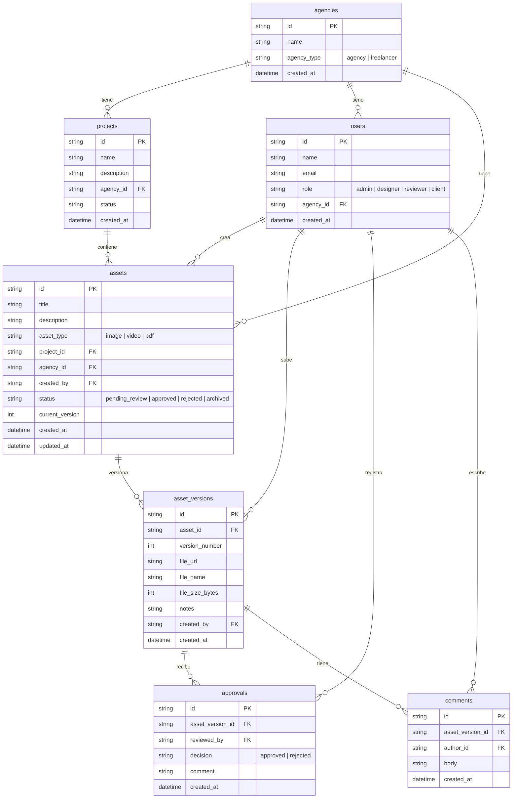

```mermaid
erDiagram
    agencies {
        string id PK
        string name
        string agency_type "agency | freelancer"
        datetime created_at
    }

    projects {
        string id PK
        string name
        string description
        string agency_id FK
        string status
        datetime created_at
    }

    users {
        string id PK
        string name
        string email
        string role "admin | designer | reviewer | client"
        string agency_id FK
        datetime created_at
    }

    assets {
        string id PK
        string title
        string description
        string asset_type "image | video | pdf"
        string project_id FK
        string agency_id FK
        string created_by FK
        string status "pending_review | approved | rejected | archived"
        int current_version
        datetime created_at
        datetime updated_at
    }

    asset_versions {
        string id PK
        string asset_id FK
        int version_number
        string file_url
        string file_name
        int file_size_bytes
        string notes
        string created_by FK
        datetime created_at
    }

    approvals {
        string id PK
        string asset_version_id FK
        string reviewed_by FK
        string decision "approved | rejected"
        string comment
        datetime created_at
    }

    comments {
        string id PK
        string asset_version_id FK
        string author_id FK
        string body
        datetime created_at
    }

    agencies ||--o{ projects      : "tiene"
    agencies ||--o{ users         : "tiene"
    agencies ||--o{ assets        : "tiene"
    projects ||--o{ assets        : "contiene"
    users    ||--o{ assets        : "crea"
    users    ||--o{ asset_versions: "sube"
    users    ||--o{ approvals     : "registra"
    users    ||--o{ comments      : "escribe"
    assets   ||--o{ asset_versions: "versiona"
    asset_versions ||--o{ approvals: "recibe"
    asset_versions ||--o{ comments : "tiene"
```
